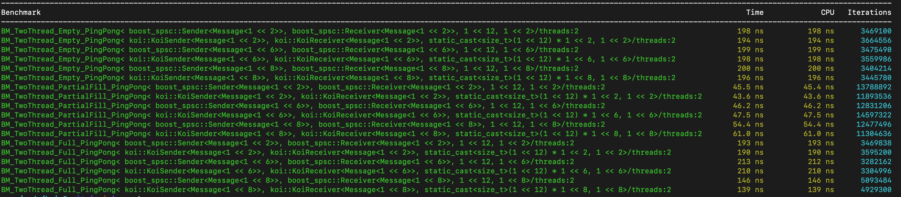

# Koi
A non-blocking, fixed-length, single producer single consumer (SPSC) high performance message queue.

**Properties**:
* Supports fixed length messages (future work is to expand to variable length messages, similar to UNIX message queues based on linked lists)
* Does not have a handshake joining procedure, taking inspiration from UNIX named pipes and other file based IPC mechanisms. This allows easy queue joining and queue liveness even when participants disconnect
* Backed by a persistent file, allowing queue sessions to resume even when all participants have disconnected
* Performs on par, and in some regimes better, than other popular lock free SPSC message queues (benchmarks currently include the Boost lock free SPSC queue)

# Running
Clone the repository locally and then run

```shell
# Koi build uses a git submodule pointing to `boost-cmake`, pull this repository and any nested submodules 
git submodules update --init --recursive
cmake .
make
```

The unit tests located in `tests/` can be run via:
```shell
# Runs Koi fixed size queue unit tests
bin/test/koi_fixed_size
```

The benchmarks located in `benchmarks` can be run via:
```shell
# Runs baseline memcpy benchmark
bin/benchmarks/memcpy
# Runs Koi fixed size benchmark
bin/benchmarks/spsc_benchmarks
```

# Benchmarks
Koi is benchmarked against other C++ SPSC implementations, namely Boost SPSC. Others can be added in the future. Benchmarks test throughput (messages / sec) with different message sizes across a number of iterations using [Google's C++ microbenchmark framework](https://github.com/google/benchmark/tree/main). Benchmarks are run via a harness in `benchmarks/spsc_benchmarks.cc` which presents a unified interface for different SPSC implementations.

Benchmarks are run on a MacOS machine with a M1 Max chip with 10 cores and the following specifications, as reported by Google Benchmarks:
```
Run on (10 X 24 MHz CPU s)
CPU Caches:
  L1 Data 64 KiB
  L1 Instruction 128 KiB
  L2 Unified 4096 KiB (x10)
```

This machine has relatively large page table sizes (`hw.pagesize: 16384`) a 12MB performance L2 cache (`hw.perflevel0.l2cachesize: 12582912`) and a 4MB efficiency L2 cache (`hw.perflevel1.l2cachesize: 4194304`) and 128 byte cache lines (`hw.cachelinesize: 128`).

Koi is benchmarked against:
- Boost [lock free SPSC queue](https://www.boost.org/doc/libs/1_76_0/doc/html/boost/lockfree/spsc_queue.html)

The results for an arbitrary single run is below:


Three regimes are tested: the empty, partially filled ([1/4, 3/4]), and full. Typically, empty and full regimes will have the highest contention between the head and tail of the ring buffer so will see higher latencies. The table displays the average latency over many iterations of an individual `send()` or `recv()` operation, calculated by the Google Benchmark framework, over a number of iterations. For each regime, the queue size is fixed at a capacity of `2^12` messages, and multiple message sizes are tested ([`2^2`, `2^6`, and `2^8` bytes]). 

Koi demonstrates slightly better performance than Boost SPSC in the empty and full regimes across all message sizes. In the partially full regime, Koi performs slightly better for smaller message sizes, and slightly worse for larger sizes.

# Repository Structure
- Unit tests: Located under `tests/fixed_size/koi_queue` for Koi fixed size queue unit tests. These test basic single threaded ping pongs as well as multi process ping pongs.
- Benchmarks: Benchmarks are run via Google Benchmarks and located under the `benchmarks` folder. Benchmarks generally measure the time for one ping-pong for varying queue sizes and message sizes (in bytes).  

# Implementations
The below describes the implementations of thevarious benchmarks at a high level. More context is given on the Koi queue implementation in the [Theory](#theory) section.

All implementations require the following guarantees:
- Senders receive an indicator value when attempting to send while the buffer is full
- Receivers receive an indicator value when attempting to read while the buffer is empty
- Receivers receive messages in the order in which they are sent and all messages are received
- The queues should only be used by one sender and one producer (SPSC)
- A message can only be read by one receiver

Koi is stored in shared memory. This gives two desirable properties: 
- **Performance**: Shared memory is faster (e.g. measured by read-write throughput in bytes/sec) than other UNIX IPC primitives by an order of magnitude (see [IPC Benchmarks](https://github.com/brylee10/unix-ipc-benchmarks)). Shared memory via `mmap` in the process address space is performant compared to kernel managed IPC data structures (sockets, pipes, message queues) because it avoids copying message data from the user address space to the kernel address space and visa versa. After the `mmap`, reading/writing from shared memory does not require any system call context switch, unlike other listed methods. 
- **Persistence**: The named shared memory segment on disk can persist while there are no senders or receivers. This allows for easier recovery and state introspectability via utility functions, for example.  

Koi's backing data structure is implemented as an [implicit data structure](<https://en.wikipedia.org/wiki/Implicit_data_structure#:~:text=Historically%2C%20Munro%20%26%20Suwanda%20(1980,single%20array%2C%20with%20only%20the>). The backing structure can be thought of as a Ring Buffer or a linked list, in particular where nodes are contiguous and equal sized, similar to an array. This supports Koi's fixed sized message implementation. Future work includes expanding Koi to support variable length messages, similar to the UNIX message queue. The message queue uses linked lists and Koi's contiguous shared memory can create an implicit linked list data structure by appending the message length as metadata to each element. 

Koi uses a set of performance optimizations:
- Cache aligned message sizes to avoid false sharing: As demonstrated by [previous benchmarks](https://github.com/brylee10/cache-effects), [false sharing](https://en.wikipedia.org/wiki/False_sharing) caused by multiple variables sharing the same cache line can cause frequent coherence cache misses. In an IPC queue's case, messages which share a cache line would experience false sharing particularly in regimes of high contention (e.g. empty queues). Koi messages are padded up to the nearest cache line multiple to reduce this effect.
- Shared memory size is a power of two: Given the modulo operator is expensive relative to other arithmetic operations, the ring buffer wrapping operation (when reaching index `N` in the buffer and wrapping back to index `0`) should be done infrequently and efficiently. With a memory size of a power of two, a modulo operator can be converted to bitwise arithmetic (`A mod B` where `B` is `2^n` for some `n` is equivalent to `A & (B - 1)`, i.e. taking the last `n` binary digits of `A`).
- Non blocking: Locks are relatively expensive, for at least 2 reasons:
    - Closely couples a producer and consumer: even if a consumer is reading an element that is in a different index than the producer, a lock is taken on the entire buffer. This leads to higher contention.
    - Incur a `futex` system call and require using the kernel futex hash table (hashed on the memory address of the mutex's underlying atomic variable) and wait queues to monitor and wake up processes. Koi avoids locks and only uses atomics for synchonization. This not called ["lock free"](https://en.wikipedia.org/wiki/Non-blocking_algorithm), which has its own formal definition.
- Cache friendly access patterns: For example, instead of the traditional Lamport Queue design of using head and tail indices, each of which would incur a cache miss, Koi is designed with inspiration from the popular [FastForward](https://www.researchgate.net/publication/213894711_FastForward_for_Efficient_Pipeline_Parallelism_A_Cache-Optimized_Concurrent_Lock-Free_Queue) queue, which replaces one of these indices with a flag in the message header which is adjacent to the message data, avoiding a cache miss. Additionally, elements inside the `ControlBlock` are deliberately duplicated to be placed on a single cache line for each the reader and writer, allowing wrapping operations on the ring buffer to all use prefetched values.
```
// The following three control block fields are all on the same cacheline
control_block_->read_offset = (control_block_->read_offset + control_block_->r_message_block_sz) & (control_block_->r_user_shm_size - 1);
```
